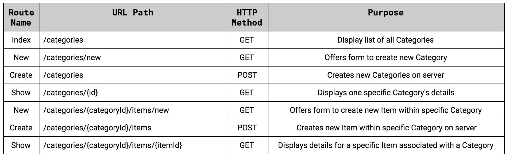
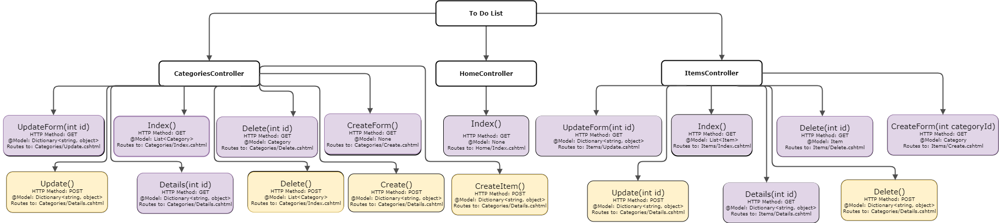

# _To Do List_

#### By _**Gareth Grindeland**_

#### _A web application built with C#/.NET using MVC and RESTful routing._

## Technologies Used

* Git
* C#/.NET version 6.0.402
* Microsoft Visual Studio Code UnitTesting

## Description

_This is a basic console application that allows users to input categories and lists of to do items. This project was completed for week 9 of Epicodus to practice using the MVC model with objects nested inside of objects._

## Setup/Installation Requirements

* _Clone this repository to your desktop._
* _Open your shell (e.g., Terminal or GitBash) and navigate to this project's root directory named "ToDoList.Solution"._
#### To Run Tests:
* _Navigate to this project's test directory named "ToDoList.Tests"._
* _Within the test directory, run ```dotnet test``` in the command line to invoke MSTest to run tests. The test results will appear in the terminal._
#### To Run the Console App for the Project:
* _Navigate to this project's production directory named "ToDoList"._
* _Run ```dotnet watch run``` in the command line to start the application. This will open up the webpage in your browser._
* _To exit out of the application, you can use the keyboard command "CTRL+C" on Mac and Windows._
* _Optionally, you can run ```dotnet build``` within the "ToDoList" directory to compile this app without running it._

## File Structure
```
ToDoList.Solution
├── ToDoList
│   ├── Controllers
│   │   ├── CategoriesController.cs
│   │   ├── HomeController.cs
│   │   └── ItemsController.cs
│   ├── Models
│   │   ├── Category.cs
│   │   └── Item.cs
│   ├── Program.cs
│   ├── Properties
│   │   └── launchSettings.json
│   ├── ToDoList.csproj
│   └── Views
│       ├── Home
│       │   └── Index.cshtml
│       └── Items
│           ├── DeleteAll.cshtml
│           ├── Index.cshtml
│           ├── New.cshtml
│           └── Show.cshtml
└── ToDoList.Tests
    ├── ModelTests
    │   ├── CategoryTests.cs
    │   └── ItemTests.cs
    └── ToDoList.Tests.csproj
```
## Images to Reference




## Known Bugs

* _No known bugs_

## License

_MIT License_

_Copyright (c) 2023 Gareth Grindeland_